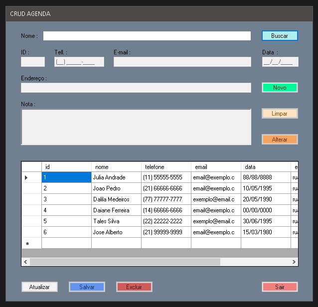

# CRUD Agenda

 Projeto de uma (agenda de contatos) feito no **Visual Studio** utilizando **C#** e **MySQL** visando de forma simples os conceitos básicos de um **CRUD**.

## Tela (Form) do Aplicativo
 
 
 
## Para rodar o banco de dados 

Foi utilizado o **WAMP** para rodar o **MySQL**.  
**Comandos SQL (query) usadas para a criação do banco e tabela.**
```SQL
/* CRIANDO O BANCO DE DADOS */
CREATE SCHEMA `bdagenda` DEFAULT CHARACTER SET utf8 ;

/* SELECIONA O BANCO DE DADOS */
USE `bdagenda`;

/* CRIAÇÃO DA TABELA */
CREATE TABLE `bdagenda`.`pessoas` (
`id` INT NOT NULL AUTO_INCREMENT,
`nome` VARCHAR(100) NOT NULL,
`telefone` VARCHAR(15) NULL,
`email` VARCHAR(50) NULL,
`data` VARCHAR(10) NULL,
`endereco` VARCHAR(100) NULL,
`nota` MEDIUMTEXT NULL,
PRIMARY KEY (`id`)
)ENGINE = InnoDB
DEFAULT CHARACTER SET = utf8;
```

-----
GitHub: [vagner-h3rd7](https://github.com/vagner-h3rd7) 
